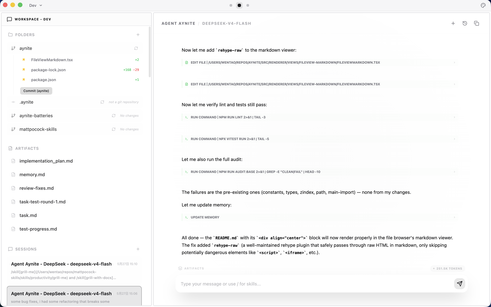
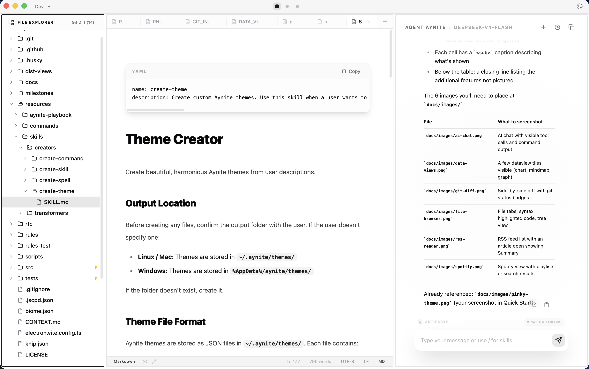
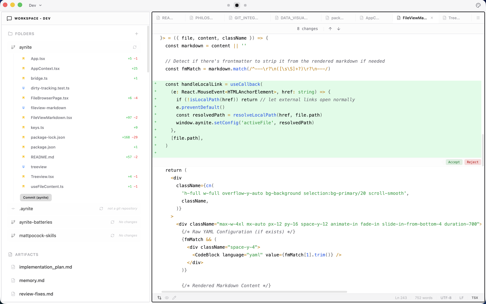
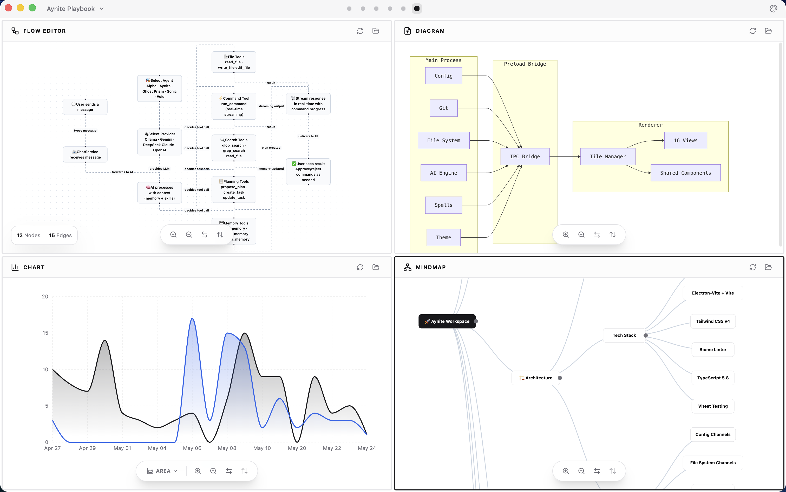
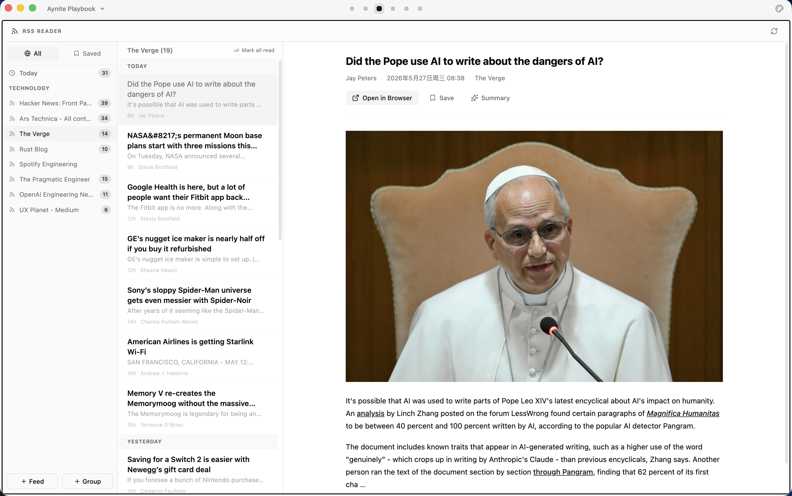
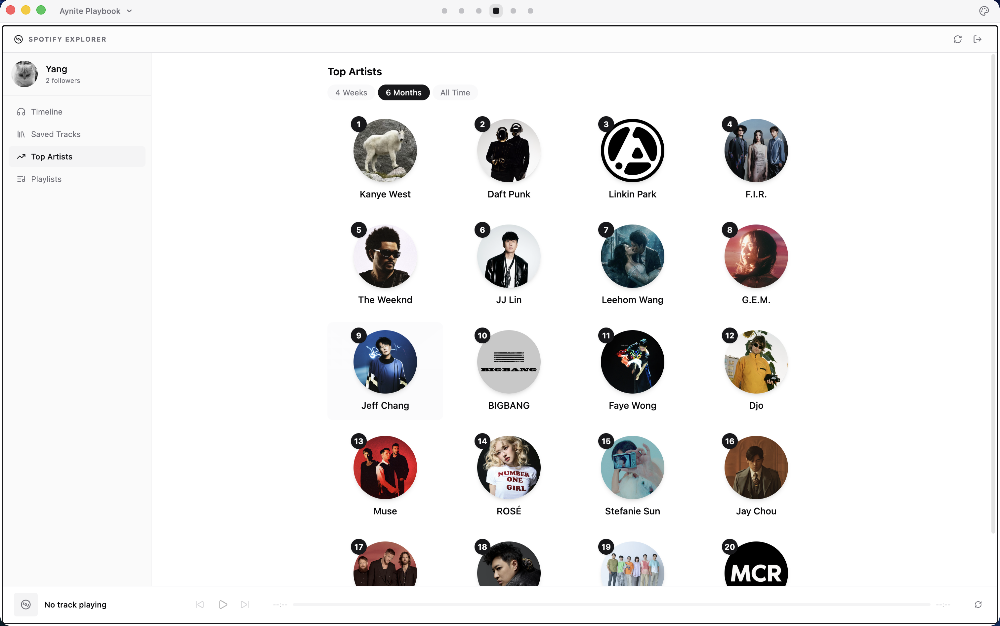
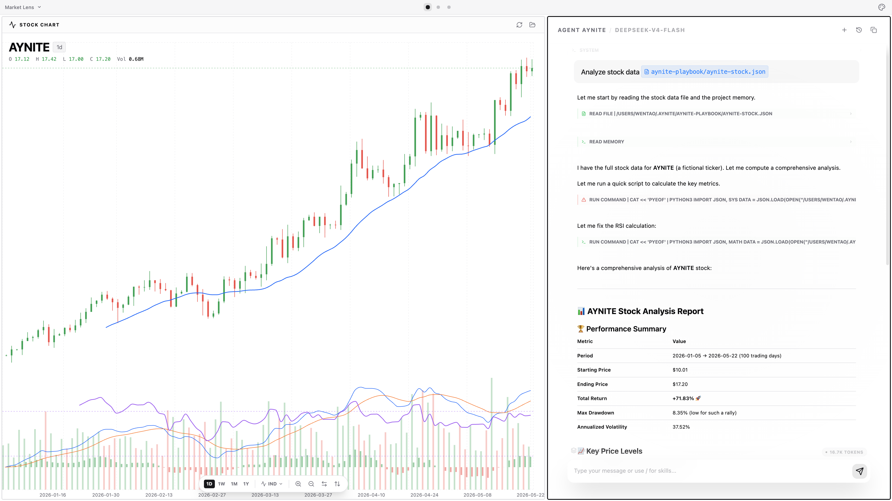
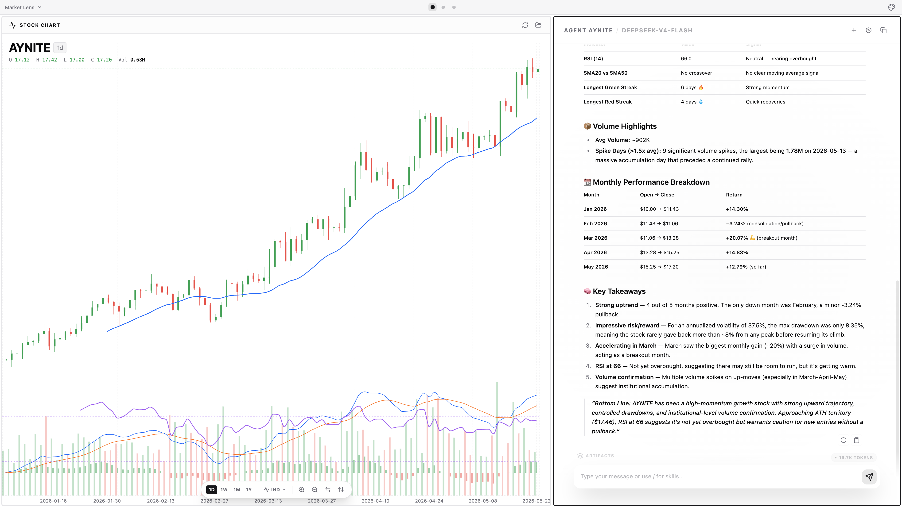
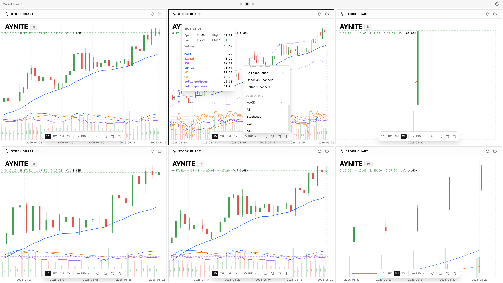
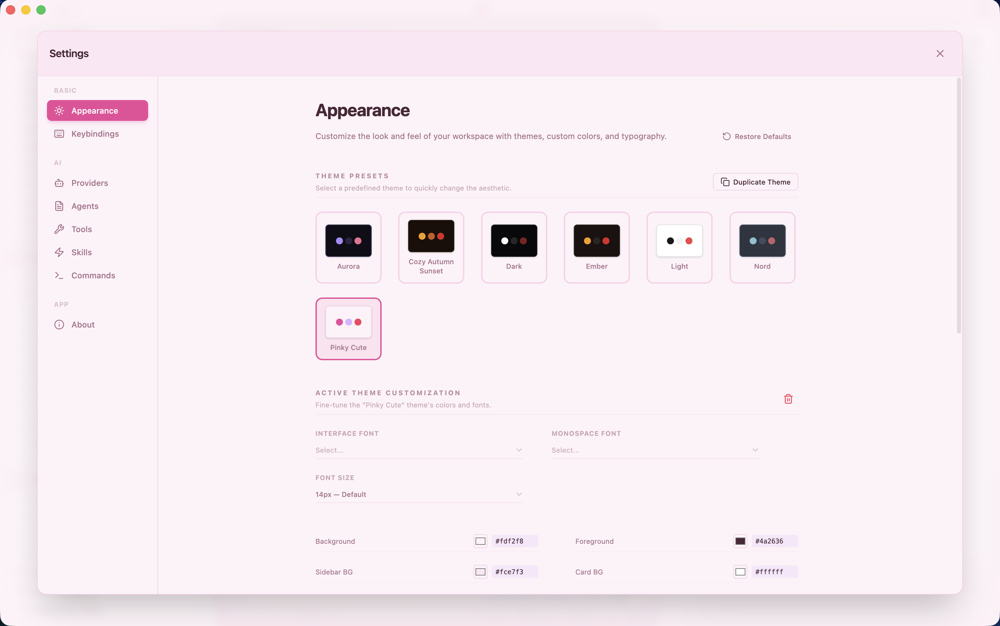

# Aynite

<div align="center">

**Pick any AI. Use any tool. Render your data any way you like. Aynite sets your creativity free.**

[](LICENSE)&nbsp; [](https://github.com/w-t-yang/aynite/releases/latest)&nbsp; [](https://github.com/w-t-yang/aynite/releases/latest)

</div>

---

## Download

<div align="center">

[](https://github.com/w-t-yang/aynite/releases/download/v0.1.4/Aynite-0.1.4-arm64.dmg)&nbsp; [](https://github.com/w-t-yang/aynite/releases/download/v0.1.4/Aynite-0.1.4.AppImage)&nbsp; [](https://github.com/w-t-yang/aynite/releases/download/v0.1.4/Aynite-Setup-0.1.4.exe)

</div>

---

## What You Can Do With Aynite

### 🤖 AI Coding Agent

<table>
  <tr>
    <td width="100%" align="center">
      
      <br>
      <sub>🤖 AI Agent — multi-provider, tool calls, command streaming</sub>
    </td>
  </tr>
  <tr>
    <td width="100%" align="center">
      
      <br>
      <sub>📂 File Browser — tabs, search, 6 file viewers</sub>
    </td>
  </tr>
  <tr>
    <td width="100%" align="center">
      
      <br>
      <sub>🔄 Git Integration — diff, hunk staging, AI commit messages</sub>
    </td>
  </tr>
</table>

Aynite is a capable AI coding agent. It reads your files, writes code, runs shell commands, manages git operations, and works across all major AI providers (OpenAI, Anthropic, Google, DeepSeek, Ollama).

**Is it perfect? No.** But it handles most coding tasks well — and it's already self-evolving.

> ⚡ **Aynite is being built with Aynite.** As of today, **43.7%** of Aynite's own commit history (229 out of 524 commits) was authored by Aynite itself (powered by DeepSeek-V4-Flash). The app reads its own source, understands its own architecture, and writes code for itself — including this very README.
>
> ```
> Aynite + DeepSeek-V4-Flash      229 commits  ( 43.7%)
> Claude Code + DeepSeek-V4-Flash   71 commits  ( 13.5%)
> Antigravity + Gemini            224 commits  ( 42.7%)
> ─────────────────────────────────────────
> Total                            524 commits
> ```
>
> Check the latest ratio anytime with `npm run count:aynite`.

---

### 🎨 Transform Any Data Into Any View

<table>
  <tr>
    <td width="100%" align="center">
      
      <br>
      <sub>8 built-in dataviews — chart, graph, flow, diagram, mindmap, canvas, stock, theme</sub>
    </td>
  </tr>
</table>

Aynite's core idea: **AI can generate standalone views on the fly.** Each view declares its expected data schema. Aynite's AI understands those schemas and converts your raw data — CSV, JSON, clipboard text, anything — into the right format for any view.

So instead of fighting with spreadsheet apps or wrestling with charting libraries, you just:

1. **Pick your data** — a file, a folder, clipboard content, an API response
2. **Pick a view** — chart, graph, mindmap, diagram, flow, canvas, stock, theme
3. **Let AI handle the transformation** — try the built-in skill: `/transform-to-dataview`

**Built-in today:** 8 dataviews (chart, graph, flow, diagram, mindmap, canvas, stock, theme) + 6 file viewers (PDF, image, audio, video, HTML, markdown). More are arriving. And because a view is just a component that reads a file and renders it, **you can build your own anytime**.

**The result? You'll never be locked into a fixed interface again.** Your data, your views, your choice.

---

### 🔌 Build Any Integration

<table>
  <tr>
    <td width="50%" align="center">
      
      <br>
      <sub>📡 RSS Reader — feed management, AI summarization</sub>
    </td>
    <td width="50%" align="center">
      
      <br>
      <sub>🎵 Spotify — browse and control your favorite songs</sub>
    </td>
  </tr>
</table>

RSS and Spotify aren't "plugins you install" — they're **reference implementations** of what's possible. Every built-in integration shows you how to connect Aynite's AI, data, and views together for any third-party service.

This opens up endless possibilities:
- **Build slides** from your notes or outlines — try `/create-slides`
- **Transform a mindmap** into a structured document, or a table into a flowchart
- **Discover new music** by asking AI to analyze your Spotify playlists
- **Summarize RSS feeds** and turn them into a personal briefing dashboard
- **Generate stock charts** with AI-powered analysis — skills for fetching and analyzing financial data are on the way

**Creativity is in your hands.** Aynite gives you the building blocks; you decide what to build.

---

### 📈 Stock Charts & Data Analysis

<table>
  <tr>
    <td width="100%" align="center">
      
      <br>
      <sub>📊 Candlestick Chart — AI-powered trend analysis on any stock data</sub>
    </td>
  </tr>
  <tr>
    <td width="100%" align="center">
      
      <br>
      <sub>🧠 AI Analysis — ask questions about trends, patterns, and forecasts</sub>
    </td>
  </tr>
  <tr>
    <td width="100%" align="center">
      
      <br>
      <sub>🪟 Tiled Layout — compare multiple charts side-by-side with built-in indicators</sub>
    </td>
  </tr>
</table>

Stock chart is one of the 8 built-in dataviews. Combined with Aynite's extensibility, it demonstrates a powerful pattern:

> **Connect any data source → Transform with AI → Render in any view**

More skills and commands are being added to let you fetch live stock data, perform technical analysis, and visualize the results — all driven by AI conversations. This is Aynite's promise in action: **no app can predict what integrations you'll need, so Aynite gives you the tools to build them yourself.**

---

### 🧩 More to Explore

Aynite is packed with capabilities that don't fit in a single screenshot:

| What | How |
|------|-----|
| **Tiled Layout** | Split tiles vertically/horizontally, multiple workspaces, multi-window support |
| **Slide Decks** | Turn notes into interactive reveal.js presentations — `/create-slides` |
| **Mind Maps** | Visualize hierarchical data as interactive trees |
| **Infinite Canvas** | Freeform sketches, wireframes, whiteboards with Excalidraw |
| **Theme Studio** | Customize 32 CSS variables, create your own with `/create-theme` |
| **AI Browser** | Browse the web through AI — ask questions about any page |
| **Workspace Manager** | Organize projects with separate workspaces, each with its own layout and files |

<div align="center">

**Whatever you want to build — Aynite is the toolkit that makes it possible.**

</div>

---

## Philosophy

Most apps bundle three things together: your data, their processing, and their interface. **Aynite unbundles them.**

```
┌──────────────────────────────────────────────────┐
│                                                  │
│    STORAGE        PROCESSING        RENDERING    │
│                                                  │
│   ┌────────┐    ┌──────────┐    ┌────────────┐   │
│   │ Your   │    │   AI     │    │  Charts    │   │
│   │ Files  │ ──▶│ Agents   │ ──▶│  Graphs    │   │
│   │        │    │ Scripts  │    │  Mindmaps  │   │
│   │ RSS    │    │Commands  │    │  Diagrams  │   │
│   │Spotify │    │ Any tool │    │  Canvases  │   │
│   └────────┘    └──────────┘    └────────────┘   │
│        │              │                │         │
│        └──────────────┴────────────────┘         │
│                       ▲                          │
│                       │                          │
│            Aynite connects them all              │
│                                                  │
└──────────────────────────────────────────────────┘
```

**Three layers. Fully decoupled. You own every layer.**

- **Your data stays yours.** Local files, your folders, your choice. Aynite looks into whatever folder you point it at — it doesn't lock your data in.
- **Process it your way.** AI agents, Python scripts, shell commands, whatever tool fits the task. The AI era makes this trivially easy.
- **Render it in any view.** Built-in charts, graphs, mindmaps, diagrams, canvases, RSS reader, Spotify player. Plus 6 file viewers (PDF, image, audio, video, HTML, markdown). More are on the way and you can build your own at anytime — a view is just a component that reads a file and renders it.

**Switch tools without switching data. Switch views without switching storage. Aynite is the hub that connects them all.**

→ **[Read the full philosophy →](docs/PHILOSOPHY.md)**

---

## Quick Start

### 1. Download

[Download the latest release](https://github.com/w-t-yang/aynite/releases/latest) for your platform — macOS (`.dmg`), Linux (`.AppImage`), or Windows (`.exe`).

### 2. Set Up Your AI Provider

Open **Settings → AI**, add your API key, pick a model, and you're ready to go.

> 💡 **Aynite doesn't try to list hundreds of AI providers.** Instead, the **Other** option lets you specify a **compatibility mode** — OpenAI, Claude, or Gemini. Most providers (OpenAI-compatible, Anthropic API-compatible, Google AI-compatible, and everything in between) are covered without an endless dropdown of names that go out of date. If your provider speaks one of these protocols, it just works.
>
> 🙋 **A note from the developer:** As a part-time individual developer, I've personally only tested Gemini, DeepSeek, and Ollama — I don't have subscriptions to every AI provider. If you run into any issues connecting to a provider, I'd greatly appreciate you [reporting it](https://github.com/w-t-yang/aynite/issues). Apologies in advance if some providers don't work out of the box!

### 3. Try Your First Chat

Open the AI chat and type:

```
/create-theme make a pinky cute theme, light mode
```

The AI will generate a custom theme. Go find it in **Settings → Appearance**.

Here is mine, how does yours look like?



### 4. Explore More

- **🗂️ Workspace** — A workspace groups your working folders together. Click the workspace name in the top-left of the title bar to create one, then add folders to it. The AI agent is aware of your workspace folders — it can read, write, and search across all of them.
- **🧩 Layout** — A layout defines your tiling arrangement. Click the layout name in the middle of the title bar to switch or create one. You can have as many layouts as you want in a workspace, each with its own unique tiling configuration.
- **🔍 Fuzzy-Find** — Prefer keyboard over mouse? Press **`Ctrl+Tab`** to fuzzy-find and open any file instantly without clicking through the tree.

→ **[Full getting started guide →](docs/GETTING_STARTED.md)**

---

## Documentation

| Guide | Description |
|-------|-------------|
| [Philosophy](docs/PHILOSOPHY.md) | The Decoupled Data Stack — Aynite's core beliefs |
| [Getting Started](docs/GETTING_STARTED.md) | From zero to your first theme |
| [Working with Files](docs/guides/WORKING_WITH_FILES.md) | File browser, tabs, search, modes |
| [AI Chat & Agents](docs/guides/AI_CHAT_AND_AGENTS.md) | Conversations, providers, sessions, skills |
| [Git Integration](docs/guides/GIT_INTEGRATION.md) | Status, diff, staging, commit |
| [Data Visualization](docs/guides/DATA_VISUALIZATION.md) | 8 dataviews, transform-to-dataview skill |
| [Customization](docs/guides/CUSTOMIZATION.md) | Themes, keybindings, settings |
| [Extending Aynite](docs/guides/EXTENDING_AYNITE.md) | Skills, commands, spells, dataviews |
| [Workspaces & Layout](docs/guides/WORKSPACES_AND_LAYOUT.md) | Multi-workspace, tiles, multi-window |
| [Integrations](docs/guides/INTEGRATIONS.md) | RSS, Spotify |
| [Developer Guide](docs/DEVELOPER.md) | Architecture, building, testing, contributing |

---

## Built With

- **[Electron](https://www.electronjs.org/)** — Desktop application framework
- **[Vercel AI SDK](https://sdk.vercel.ai/)** — Unified AI provider interface
- **[React](https://react.dev/)** — UI components
- **[Vite](https://vitejs.dev/)** — Build tooling
- **[Tailwind CSS](https://tailwindcss.com/)** — Styling
- **[TypeScript](https://www.typescriptlang.org/)** — Type safety

---

## Project Status

Aynite is in active development (beta). The app ships regularly, has a growing set of integrations, and a clear architectural vision. Some features are still rough around the edges — that's intentional. Every release gets closer to the goal.

**[View releases →](https://github.com/w-t-yang/aynite/releases)**

---

## Contributing

Everyone is welcome to contribute! There's just one small request: **write your code and make contributions with Aynite**. I believe contributors should be the people who love using Aynite the most — for everything.

> ⚡ **Aynite Contribution Ratio** — Up to this point, **43.7%** of the project's commit history has already been authored by Aynite itself (powered by DeepSeek-V4-Flash), and this ratio keeps climbing. Aynite is being built with Aynite.
>
> ```
> Aynite + DeepSeek-V4-Flash      229 commits  ( 43.7%)
> Claude Code + DeepSeek-V4-Flash   71 commits  ( 13.5%)
> Antigravity + Gemini            224 commits  ( 42.7%)
> ─────────────────────────────────────────
> Total                            524 commits
> ```
>
> Check the latest ratio anytime with `npm run count:aynite`.


**If you'd like to contribute skills, commands, dataviews, or fileviews**, head over to the [aynite-batteries](https://github.com/w-t-yang/aynite-batteries) repo — that's the dedicated place for community extensions. For core app changes (main process, renderer, architecture), this repo is the right place.

## Contributors

<!-- contributors:start -->

<a href="https://github.com/w-t-yang"></a>
<a href="https://github.com/apps/dependabot"></a>

<!-- contributors:end -->

---

## License

[MIT](LICENSE) © Wentao Yang
